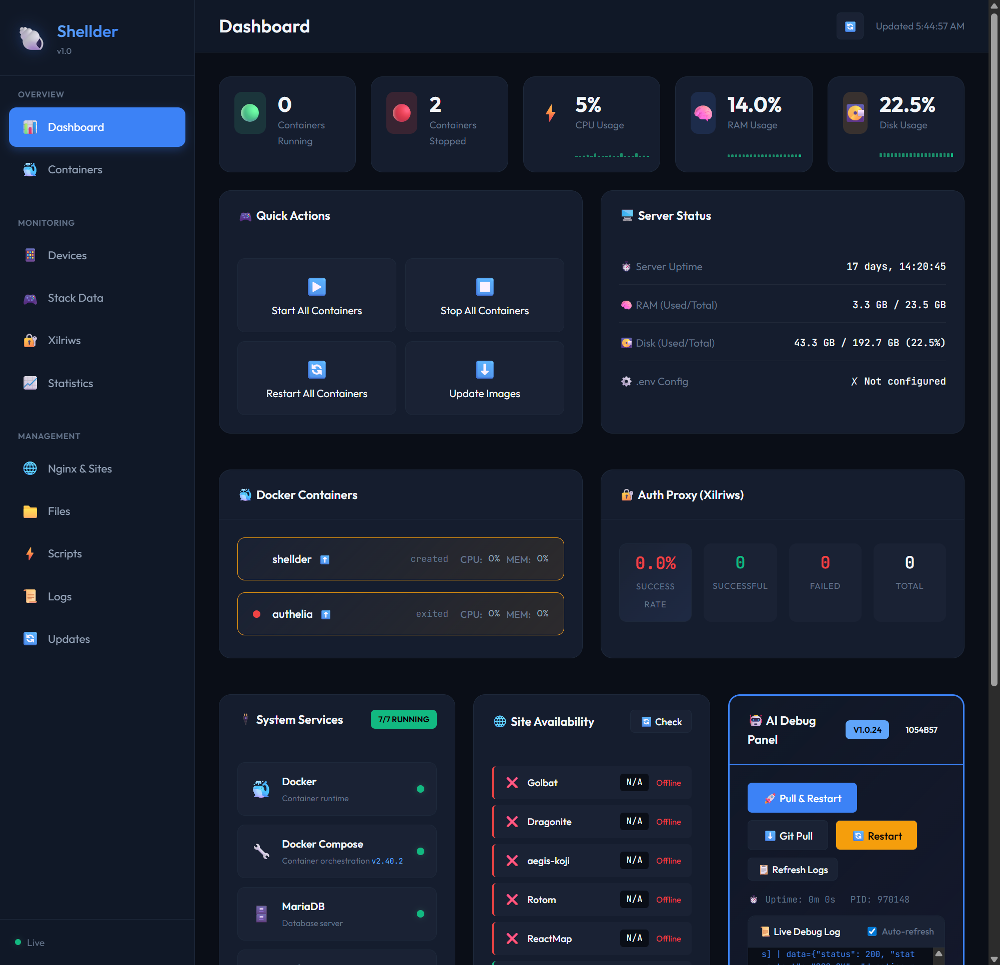

# Services

Overview of all services in the Aegis AIO stack.

---

## Core Services

### ReactMap (Port 6001)

The user-facing map interface displaying:
- Pokemon spawns and IVs
- Raids and gyms
- Pokestops and quests
- Nests (with Fletchling)

### Dragonite Admin (Port 6002)

Scanner management dashboard for:
- Adding and managing accounts
- Viewing worker status
- Configuring scan settings
- Monitoring scan progress

### Rotom (Port 6003 + 7070)

Device manager that:
- Receives connections from Aegis devices (port 7070)
- Assigns tasks to devices
- Monitors device health
- Manages device configurations

### Koji (Port 6004)

Geofence management tool for:
- Drawing scan areas on a map
- Creating projects (area groups)
- Exporting geofences to services
- Managing Pokemon spawn points

---

## Database & Monitoring

### MariaDB

Central database storing all game data:
- Pokemon sightings
- Gyms and raids
- Accounts and workers
- Configuration data

### phpMyAdmin (Port 6005)

Database management interface for:
- Viewing and editing tables
- Running SQL queries
- Managing users and permissions
- Database maintenance

### Grafana (Port 6006)

Performance monitoring with:
- Real-time statistics dashboards
- Pokemon catch rates
- Device performance metrics
- Historical data analysis

> 💡 Grafana runs with proper PUID/PGID permissions from `.env`

---

## Proxy & Authentication

### Xilriws (Port 5090)

Pokemon GO API proxy that:
- Handles authentication requests
- Obtains login cookies for accounts
- Manages proxy rotation
- Provides account status monitoring

See [[Xilriws]] for detailed management.

---

## Management Services

### Shellder (Port 5000)

Web dashboard and management service providing a unified control center:

| Feature | Description |
|---------|-------------|
| **Live Dashboard** | Real-time CPU, RAM, Disk metrics with sparkline graphs |
| **Container Control** | Start/stop/restart containers with status indicators |
| **System Services** | Monitor Docker, MariaDB, Nginx, Python status |
| **Site Availability** | HTTP health checks for all configured sites |
| **Xilriws Stats** | Live proxy success rates and error tracking |
| **Metric History** | 10m/1h/6h/24h/7d historical charts |
| **Log Viewer** | Aggregated logs with search capability |
| **AI Debug Panel** | Live debug logs, Pull & Restart controls |



See [[Shellder]] for full documentation.

### Device Monitor (Built into Shellder)

Real-time monitoring integrated into the Shellder dashboard:

| Feature | Description |
|---------|-------------|
| **Live Events** | Stream device activity from Rotom/Dragonite |
| **Crash Detection** | Automatic crash logging with context |
| **Memory Tracking** | Device memory reports from Rotom |
| **Cross-Reference** | Correlate events across logs and database |

---

## Optional Services

### Poracle

Discord/Telegram notifications for:
- Pokemon spawns
- Raids
- Quests

### Fletchling

Nest detection and display on ReactMap.

See [[Optional-Features]] for setup guides.

---

## Service Architecture

```
┌──────────┐    ┌──────────┐    ┌──────────┐    ┌──────────┐
│  Aegis   │───▶│  Rotom   │───▶│ Dragonite│───▶│  Golbat  │
│ (Device) │    │ (Manager)│    │ (Scanner)│    │(Processor│
└──────────┘    └──────────┘    └──────────┘    └──────────┘
     │                │               │               │
     │                ▼               ▼               ▼
     │          ┌─────────────────────────────────────┐
     │          │            MariaDB                   │
     │          └─────────────────────────────────────┘
     │                              │
     │                              ▼
     │          ┌──────────┐  ┌──────────┐  ┌──────────┐
     └─────────▶│ ReactMap │  │   Koji   │  │ Grafana  │
    Port 7070   └──────────┘  └──────────┘  └──────────┘
```

---

[[← Installation|Installation]] | [[Next: Security →|Security]]

